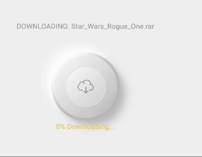

# fancy Loading Button
Loading Animated Widget using Neumorphism.



# Example with Stream:
```@dart
import 'dart:async';
import 'dart:math';

import 'package:fancy_loading_button/widgets/download_button.dart';
import 'package:flutter/material.dart';

class DownloadButtonPage extends StatefulWidget {
  final String filename;

  const DownloadButtonPage({required this.filename, super.key});

  @override
  _DownloadButtonPageState createState() => _DownloadButtonPageState();
}

class _DownloadButtonPageState extends State<DownloadButtonPage> {
  late StreamController<double> _progressStreamController;
  late Stream<double> _progressStream;

  @override
  void initState() {
    super.initState();

    _progressStreamController = StreamController<double>();
    _progressStream = _progressStreamController.stream;

    // Simulate progress updates
    simulateProgress();
  }

  // Simulates progress updates and adds values to the stream
  void simulateProgress() async {
    for (int i = 0; i <= 100; i += 10) {
      Random random = Random();
      final int milisec = random.nextInt(1500) + 200;
      await Future.delayed(Duration(milliseconds: milisec));
      _progressStreamController.add(i + (i * 0.3));
    }
    _progressStreamController.close();
  }

  @override
  Widget build(BuildContext context) {
    return StreamBuilder<double>(
      stream: _progressStream,
      builder: (context, snapshot) {
        late final double progress;
        if (snapshot.hasError) {
          progress = 0;
          return Text('Error: ${snapshot.error}');
        }
        if (snapshot.hasData) {
          progress = snapshot.data!;
        } else {
          progress = 0;
        }
        return DownloadButton(
          filename: widget.filename,
          progress: progress,
          firstIconColor: Colors.black45,
          secondIconColor: const Color(0xFFffd11a).withOpacity(0.9),
          baseColor: const Color(0xFFf2f2f2),
        );
      },
    );
  }

  @override
  void dispose() {
    _progressStreamController.close();
    super.dispose();
  }
}


```